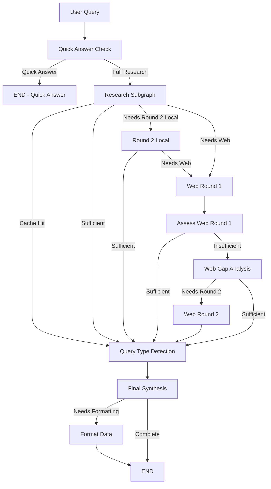

# Full Research Agent Workflow Analysis

## Complete Workflow Flow

## Detailed Round Analysis

### 1. Quick Answer Check ✅ **HIGH VALUE**

**Purpose**: Fast path for queries that can be answered from general knowledge without research

**What it does**:
- Fast vector search (2s timeout, 8 results max)
- LLM evaluation: "Can this be answered from general knowledge?"
- If yes → short-circuit to quick answer
- If no → proceed to full research

**Value**: 
- ✅ **Significant time savings** for simple queries
- ✅ **Reduces unnecessary research** for common knowledge questions
- ✅ **Fast user experience** for straightforward queries

**Potential Issues**: None - this is a smart optimization

---

### 2. Research Subgraph (Round 1) ✅ **CORE VALUE** (but has web search built-in!)

**Purpose**: Initial comprehensive research with local + web sources

**What it does**:
1. **Cache Check**: Look for previous research in conversation history
2. **Query Expansion**: Generate 3 semantic query variations
3. **Parallel Search**: 
   - Local: Intelligent document retrieval (vector + full doc search)
   - **Web: Web search + crawl top 3 URLs** ⚠️ **ALREADY DOES WEB SEARCH!**
4. **Assessment**: LLM evaluates if results are sufficient
5. **Gap Analysis**: If insufficient, identify what's missing

**Value**:
- ✅ **Cache Check**: Reuses previous research (major time/API savings)
- ✅ **Query Expansion**: Improves search coverage with semantic variations
- ✅ **Parallel Search**: Efficiently searches both local and web simultaneously
- ✅ **Assessment**: Smart decision-making about sufficiency
- ✅ **Gap Analysis**: Identifies specific gaps for targeted Round 2

**⚠️ CRITICAL ISSUE**: Research Subgraph **already does web search** (see `web_search_task` in research_workflow_subgraph.py:260-293), producing `web_round1_results`. But then the Full Research Agent has a separate "Web Round 1" node that does web search again!

**Potential Issues**: 
- ⚠️ **Query Expansion returning 0 variations** - Fixed with fallback to original query
- ⚠️ **Redundant web search** - Research Subgraph already does web, then separate Web Round 1 node does it again

---

### 3. Round 2 Local (Gap Filling) ✅ **HIGH VALUE**

**Purpose**: Targeted local research using identified gaps from Round 1

**What it does**:
- Uses research subgraph with `skip_cache=True`, `skip_expansion=True`
- Uses `identified_gaps` as queries (top 3 gap queries)
- Searches local documents + web for gap-specific information

**Value**:
- ✅ **Targeted search** - Uses specific gap queries instead of broad original query
- ✅ **Efficient** - Skips cache (already checked) and expansion (gaps are already specific)
- ✅ **Comprehensive** - Still does both local + web search for gaps

**Potential Issues**: None - this is well-designed

---

### 4. Web Round 1 ⚠️ **REDUNDANT - NEEDS CLARIFICATION**

**Purpose**: Additional web research when initial web search insufficient

**What it does**:
- Uses Web Research Subgraph
- Web search + URL extraction + crawl top 3 URLs
- Returns structured sources for citations

**⚠️ CRITICAL ISSUE**: This is REDUNDANT with Research Subgraph!

**The Problem**:
- Research Subgraph **already does web search** in Round 1 (see `web_search_task` in research_workflow_subgraph.py:260-293)
- Research Subgraph already produces `web_round1_results`
- The separate "Web Round 1" node does the **same web search again**

**Current Flow (Confusing)**:
1. Research Subgraph does web search → gets `web_round1_results`
2. Assessment says `needs_more_web=True`
3. Routes to separate "Web Round 1" node
4. Does web search **again** (redundant!)

**When it runs**:
- After Research Subgraph if `needs_more_web=True` OR `gap_severity=severe` + `needs_web_search=True`
- After Round 2 Local if Round 2 insufficient

**Potential Issues**: 
- ⚠️ **REDUNDANT**: Research Subgraph already did web search
- ⚠️ **CONFUSING NAMING**: Both produce "web_round1_results"
- ⚠️ **WASTEFUL**: May crawl same URLs twice

**Recommendation**: 
- **Option 1**: Remove separate Web Round 1 node, use Research Subgraph's web results
- **Option 2**: Rename to "Web Round 2" and make it more targeted (use gap queries)
- **Option 3**: Make Research Subgraph web search optional, only do it when explicitly needed

---

### 5. Assess Web Round 1 ✅ **HIGH VALUE**

**Purpose**: Evaluate if Web Round 1 results are sufficient

**What it does**:
- Uses Assessment Subgraph
- LLM evaluates: sufficient, relevant, missing_info, confidence, reasoning

**Value**:
- ✅ **Smart routing** - Decides if we need Web Round 2 or can synthesize
- ✅ **Prevents unnecessary rounds** - Stops early if sufficient
- ✅ **Context-aware** - Includes conversation history for better assessment

**Potential Issues**: None - this prevents unnecessary Web Round 2

---

### 6. Web Gap Analysis ✅ **HIGH VALUE**

**Purpose**: Analyze gaps in Web Round 1 results to determine if Round 2 Web is needed

**What it does**:
- Uses Universal Gap Analysis Subgraph
- Analyzes Web Round 1 results for missing information
- Determines if Round 2 Web would be beneficial

**Value**:
- ✅ **Prevents unnecessary Round 2** - Only does Round 2 if gaps are significant
- ✅ **Targeted** - Identifies specific gaps for Round 2 queries
- ✅ **Efficient** - Universal subgraph, reusable logic

**Potential Issues**: None - this is smart decision-making

---

### 7. Web Round 2 ⚠️ **QUESTIONABLE VALUE**

**Purpose**: Targeted web research using gaps from Web Round 1

**What it does**:
- Uses Web Research Subgraph with `web_identified_gaps` as queries
- Web search + crawl for gap-specific information

**Value**:
- ✅ **Targeted** - Uses specific gap queries
- ⚠️ **May be redundant** - If Web Round 1 already crawled top results, Round 2 might find same/similar content
- ⚠️ **Limited benefit** - Web search results are often similar across rounds

**Potential Issues**:
- ⚠️ **Redundancy risk**: Web Round 2 might crawl URLs already seen in Round 1
- ⚠️ **Diminishing returns**: Second web search may not add much new information
- ✅ **Still valuable** if gaps are specific and different from Round 1 query

**Recommendation**: Keep but consider adding URL deduplication to avoid crawling same URLs

---

### 8. Query Type Detection ✅ **HIGH VALUE**

**Purpose**: Determine synthesis approach (objective vs subjective)

**What it does**:
- LLM classifies query as: objective, subjective, or mixed
- Determines if should synthesize single answer or present 2-3 options
- Sets `should_present_options` and `num_options`

**Value**:
- ✅ **Better UX** - Subjective queries get multiple options (e.g., "best recipe")
- ✅ **Appropriate synthesis** - Objective queries get synthesized single answer
- ✅ **Flexible** - Handles mixed queries appropriately

**Potential Issues**: None - this is excellent UX design

---

### 9. Final Synthesis ✅ **CORE VALUE**

**Purpose**: Combine all research into comprehensive answer

**What it does**:
- Gathers all results: cache, Round 1, Round 2, Web Round 1, Web Round 2
- Generates different prompts based on query type (objective/subjective/mixed)
- Includes citations from all sources
- Handles agent handoffs and reference documents

**Value**:
- ✅ **Comprehensive** - Uses all gathered information
- ✅ **Context-aware** - Includes conversation history
- ✅ **Proper citations** - Tracks sources from all rounds
- ✅ **Query-type aware** - Different synthesis for objective vs subjective

**Potential Issues**: None - this is the core output

---

## Workflow Efficiency Analysis

### Optimal Paths

1. **Cache Hit Path**: `Quick Check → Research Subgraph (cache hit) → Query Type → Synthesis`
   - **Value**: ✅ Excellent - Reuses previous research
   - **Steps**: 4 nodes
   - **Time**: ~2-3 seconds

2. **Quick Answer Path**: `Quick Check → Quick Answer`
   - **Value**: ✅ Excellent - Fast for simple queries
   - **Steps**: 2 nodes
   - **Time**: ~2-4 seconds

3. **Round 1 Sufficient Path**: `Quick Check → Research Subgraph (sufficient) → Query Type → Synthesis`
   - **Value**: ✅ Excellent - Comprehensive but efficient
   - **Steps**: 4 nodes
   - **Time**: ~10-15 seconds

4. **Round 1 → Round 2 Local → Synthesis**: `Quick Check → Research Subgraph → Round 2 Local → Query Type → Synthesis`
   - **Value**: ✅ Good - Targeted gap filling
   - **Steps**: 5 nodes
   - **Time**: ~15-20 seconds

5. **Round 1 → Web Round 1 → Synthesis**: `Quick Check → Research Subgraph → Web Round 1 → Assess → Query Type → Synthesis`
   - **Value**: ✅ Good - Web research when needed
   - **Steps**: 6 nodes
   - **Time**: ~20-25 seconds

6. **Full Path**: `Quick Check → Research Subgraph → Round 2 Local → Web Round 1 → Assess → Web Gap Analysis → Web Round 2 → Query Type → Synthesis`
   - **Value**: ⚠️ **Questionable** - May be over-researching
   - **Steps**: 9 nodes
   - **Time**: ~30-40 seconds

### Potential Issues

#### 1. ⚠️ **Web Round 2 May Be Redundant**

**Problem**: Web Round 2 might crawl URLs already seen in Web Round 1, or find similar content.

**Evidence**:
- Web Round 1 already crawls top 3 URLs from search results
- Web Round 2 uses gap queries, but web search engines often return similar top results
- Limited benefit from second web search round

**Recommendation**:
- ✅ **Add URL deduplication**: Track URLs crawled in Round 1, skip in Round 2
- ✅ **Consider skipping Web Round 2** if Web Round 1 found high-quality sources
- ✅ **Make Web Round 2 more targeted**: Use very specific gap queries, not just first gap

#### 2. ✅ **Round 2 Local is Well-Designed**

**Good**: Uses research subgraph with gap queries, skips cache/expansion appropriately.

#### 3. ✅ **Assessment Nodes Provide Value**

**Good**: Both `assess_combined_round1` and `assess_web_round1` prevent unnecessary rounds.

#### 4. ⚠️ **Query Expansion Returning 0 Variations**

**Status**: ✅ **FIXED** - Now falls back to original query if expansion returns empty list.

#### 5. ✅ **Gap Analysis is Smart**

**Good**: Universal gap analysis subgraph identifies specific gaps and determines if web/local search would help.

---

## Recommendations

### 🔴 **CRITICAL PRIORITY**

1. **Fix Redundant Web Round 1**
   - **Problem**: Research Subgraph already does web search, but separate "Web Round 1" node does it again
   - **Options**:
     - **Option A**: Remove separate Web Round 1 node, use Research Subgraph's `web_round1_results` directly
     - **Option B**: Make Research Subgraph web search optional (only when `needs_web=True` from routing)
     - **Option C**: Rename separate node to "Web Round 2" and make it gap-query targeted
   - **Recommendation**: Option A - Remove redundant node, use Research Subgraph results

### High Priority

2. **Add URL Deduplication for Web Rounds**
   - Track URLs crawled in Research Subgraph web search
   - Skip those URLs in any subsequent web rounds
   - Prevents redundant crawling

3. **Improve Web Round 2 Targeting**
   - Use more specific gap queries (not just first gap)
   - Consider combining multiple gaps into one query
   - Add domain-specific search hints (e.g., `site:example.com`)

### Medium Priority

3. **Consider Skipping Web Round 2 More Aggressively**
   - If Web Round 1 found high-quality sources (official sites, high relevance)
   - If gap severity is "minor" after Web Round 1
   - Add confidence threshold: only do Round 2 if confidence < 0.7

4. **Optimize Round 2 Local**
   - Currently does both local + web search
   - Consider: if gaps are local-specific, skip web in Round 2 Local
   - Use gap analysis `needs_local_search` vs `needs_web_search` flags

### Low Priority

5. **Add Round Limits**
   - Cap total rounds at 3 (Round 1, Round 2 Local, Web Round 1)
   - Prevent infinite loops or excessive research
   - Log when hitting round limits

---

## Summary

### ✅ **Excellent Design**
- Quick Answer Check (fast path)
- Research Subgraph (comprehensive Round 1)
- Round 2 Local (targeted gap filling)
- Assessment nodes (smart routing)
- Query Type Detection (better UX)
- Final Synthesis (comprehensive output)

### ⚠️ **Critical Issues**
- **Web Round 1 is REDUNDANT** - Research Subgraph already does web search!
- Web Round 2 may be redundant (add URL deduplication)
- Consider more aggressive skipping of Web Round 2
- Optimize Round 2 Local based on gap analysis flags

### 📊 **Overall Assessment**

**Workflow Quality**: 8.5/10

**Strengths**:
- Smart routing prevents unnecessary rounds
- Comprehensive research coverage
- Efficient use of subgraphs
- Good user experience with quick answers

**Weaknesses**:
- Web Round 2 may have diminishing returns
- No URL deduplication between web rounds
- Could be more aggressive about skipping rounds

**Recommendation**: The workflow is well-designed overall. The main improvement would be adding URL deduplication and being more selective about when to do Web Round 2.

