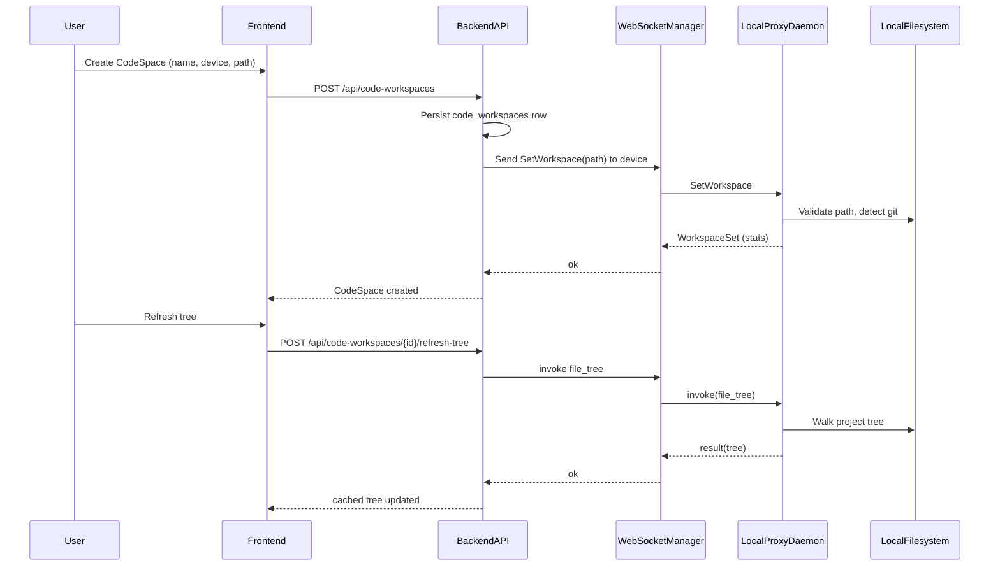

# Code Spaces — Plan

## Goal

Provide a Cursor-style “coding environment” inside Bastion by binding:

- A **project directory** (on a user’s local machine via the local proxy daemon)
- A **set of coding tools** (file tree, search, git, run commands)
- A **chat / agent session** (Agent Factory playbooks + tool packs)

This document outlines a phased plan. Phase 1 focuses on expanding the local proxy’s capabilities and adding the minimal “Code Space” foundation across backend, orchestrator, and frontend.

## Background: What exists today

Bastion already has a local proxy daemon (`local-proxy/`) connected outbound to the backend via WebSocket (`/api/ws/device`). The orchestrator can invoke device capabilities via `invoke_device_tool` and exposes them as registered tools in `llm-orchestrator/orchestrator/tools/local_proxy_tools.py`, grouped in the `local_device` tool pack (`tool_pack_registry.py`).

The local proxy is the core execution substrate for a Cursor-style experience (local filesystem + local CLI + local git).

## Phase 1 — Enhanced Proxy + Foundation (MVP)

### Outcomes

- Agents can obtain a **full project tree**, **search code**, and **read git state** without relying on unrestricted shell.
- Bastion has a first-class **Code Space** entity that ties a project path (and device) to a user-visible workspace.
- Frontend can list/create Code Spaces and show cached project structure.

### Workstreams

#### 1) Local proxy daemon: coding-critical capabilities

Add new capabilities to the daemon and expose them to the backend/orchestrator:

- `file_tree`: full recursive directory tree with depth and ignore controls
- `search_files`: content search across a directory tree (ripgrep-like)
- `git_info`: read-only git operations (`status`, `branch`, `log`, `show`, `diff`)
- Improve `list_directory` recursive semantics (depth-based) for lightweight use

#### 2) Workspace root context (“open repo”)

Add a protocol-level message that allows Bastion to set a device-side **active workspace root** so tools can accept relative paths and default to the open project directory.

#### 3) Backend: Code Space entity + APIs

Add a small table and REST endpoints:

- Store `(user_id, name, device_id/device_name, workspace_path, cached_file_tree, settings, conversation_id)`
- CRUD endpoints for user workspaces
- A “refresh tree” action that invokes the device and caches results

#### 4) Orchestrator: code workspace tools + tool pack

Add `code_workspace` tools (thin wrappers) and register a `code_workspace` tool pack.

#### 5) Frontend: Code Spaces page

Create a minimal UI to create/list Code Spaces and show cached tree.

### Data flow (Phase 1)

### Non-goals for Phase 1

- Real-time file watching / incremental indexing
- Streaming stdout/stderr for long-running commands
- IDE plugins (VS Code / JetBrains)
- Multi-user collaboration on the same code space

## Phase 2 — Codebase Indexing + Semantic Search

### Outcomes

- Bastion can answer “where is X defined?” and “show me usages” quickly using an indexed view of the repo.
- Agents can combine **symbolic** (grep-like) and **semantic** search.

### Proposed work

- Add a backend indexing pipeline for Code Spaces:
  - Pull file list + selected file contents via device tools
  - Chunk and embed code into the existing vector store
  - Store index metadata (repo hash, last indexed commit, file count)
- Add `search_codebase` tool:
  - Accept query + filters (language, path glob)
  - Return structured matches + formatted summary

## Phase 3 — Coding Agent + Rich UI

### Outcomes

- A dedicated “Coding” experience: inline diffs, file explorer, terminal panel, and a code-aware agent profile.

### Proposed work

- Add an Agent Factory template profile/playbook for “Coding Assistant”
  - Uses `code_workspace` tool pack
  - Uses a safe default policy (read-only unless explicitly allowed)
- Frontend: show file diffs for writes, allow opening files in editor panes, add terminal output panel.

## Phase 4 — Streaming + Live Updates

### Outcomes

- Long-running commands stream output (builds, tests).
- File tree and index update automatically as files change.

### Proposed work

- Protocol extension for streaming:
  - `shell_execute_stream` capability emitting `stdout_chunk` / `stderr_chunk` messages
  - cancellation support
- Daemon file watcher (e.g. `notify`) emits “file changed” events
- Backend updates cached tree/index incrementally

## Phase 5 — Collaboration + IDE Integration

### Outcomes

- Shared Code Spaces (team settings, permissions)
- Optional IDE extensions for tight loop workflows

### Proposed work

- Sharing model similar to Data Workspaces
- Team-scoped Code Spaces (optional)
- VS Code extension:
  - Auth to Bastion
  - Surfacing agent suggestions, diff application, and chat context

## Notes & Constraints

- Multi-device routing must be explicit or deterministic: when multiple devices are connected, “default device selection” should not be ambiguous.
- The local proxy is policy-controlled; Code Spaces should prefer **purpose-built capabilities** over unrestricted shell whenever possible.
