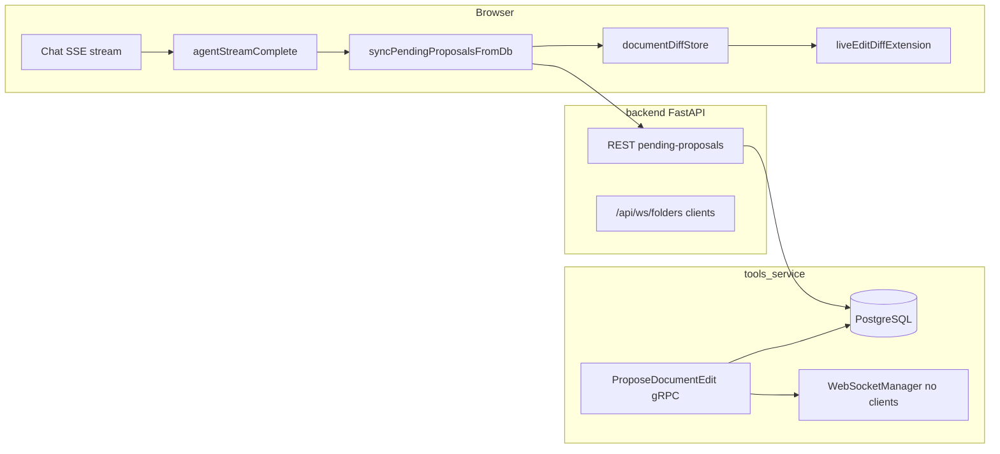

# Document edit proposal: real-time delivery architecture

## Current behavior (production)

### Data path for new proposals

1. The LLM orchestrator calls `ProposeDocumentEdit` over gRPC to **tools-service** (separate container from the backend API).
2. [backend/services/grpc_handlers/document_edit_handlers.py](../../backend/services/grpc_handlers/document_edit_handlers.py) runs `propose_document_edit_tool`, which persists the proposal in PostgreSQL and calls `container.websocket_manager.send_document_status_update(...)` with `status="edit_proposal"` and a nested `document_edit_proposal` message ([backend/utils/websocket_manager.py](../../backend/utils/websocket_manager.py)).
3. In tools-service, `get_websocket_manager()` returns a **process-local singleton** with **no connected browser WebSockets**. Connected clients are attached in the **backend** FastAPI process (`/api/ws/folders`).
4. Result: the `document_edit_proposal` WebSocket message is effectively a no-op for the UI when creation happens in tools-service.

### Reliable live trigger today

[frontend/src/contexts/ChatSidebarContext.js](../../frontend/src/contexts/ChatSidebarContext.js) dispatches `agentStreamComplete` when the chat SSE stream finishes (`complete` / `done`). [frontend/src/components/DocumentViewer.js](../../frontend/src/components/DocumentViewer.js) listens for that event and calls `syncPendingProposalsFromDb('agent_stream_complete')`, which fetches pending proposals from the REST API and merges them into `documentDiffStore`. The CodeMirror live-diff plugin subscribes to the store and renders.

Guards in DocumentViewer (debounced sync, per-proposal fingerprints) prevent duplicate work if a future path also delivers the same proposal.

### Why this matters

- Live proposal appearance is tied to **stream completion**, not to the instant the tool returns. For long multi-tool turns, users may see proposals only after the full assistant response finishes.
- Any flow that creates a proposal **without** a subsequent `agentStreamComplete` (e.g. background jobs) would still need another trigger (poll, dedicated WS relay, or SSE event).

## Target architecture (best-in-class)

### Principle

**Only the process that holds active WebSocket sessions should emit user-visible real-time events.** Cross-container tool execution must **relay** notifications to that process.

### Recommended: backend relay via gRPC or message bus

1. **Option A — gRPC callback to backend**  
   After tools-service inserts a proposal, call a small backend RPC (or HTTP internal endpoint) such as `NotifyDocumentEditProposal(user_id, document_id, proposal_id, ...)`. The backend handler uses **its** `websocket_manager` to `send_to_session` the same payload shape as today’s `document_edit_proposal` message.

2. **Option B — Redis pub/sub (or similar)**  
   Tools-service publishes `document_edit_proposal` on a channel keyed by `user_id` (or `tenant_id`). Backend subscribes on startup and forwards to `send_to_session`. Scales if multiple backend replicas must all receive and fan out (with care for deduplication).

3. **Keep the REST + `syncPendingProposalsFromDb` path** as fallback for reconnects and idempotent refresh; optional to remove `agentStreamComplete` once relay is proven in production.

### Files and components likely to change

| Area | Likelihood |
|------|------------|
| [tools-service](../../tools-service/) — publish/notify after successful `ProposeDocumentEdit` | Required |
| [backend/main.py](../../backend/main.py) or internal router — subscribe or implement notify RPC | Required |
| [backend/utils/websocket_manager.py](../../backend/utils/websocket_manager.py) — reuse `send_document_status_update` / proposal branch | Reuse |
| [backend/services/langgraph_tools/document_editing_tools.py](../../backend/services/langgraph_tools/document_editing_tools.py) — optionally stop calling WS from tools-only code paths once relay exists | Cleanup |
| [frontend/src/components/DocumentViewer.js](../../frontend/src/components/DocumentViewer.js) — debounce + fingerprint remain; `agentStreamComplete` may become optional | Simplify later |

### Alternative: SSE mid-stream `proposal_created`

The orchestrator could emit a structured SSE chunk (e.g. `type: "proposal_created", document_id, proposal_id`) as soon as the tool result is known, before the full turn completes. DocumentViewer (or a thin hook) would listen and call `syncPendingProposalsFromDb` without waiting for stream end.

**Pros:** No new infra if SSE already streams through the backend process that “owns” the session.  
**Cons:** Requires orchestrator + frontend contract changes; must still handle tools invoked outside that stream.

## Related documentation

- [in-editor-diff-system.md](in-editor-diff-system.md) — diff store, CodeMirror plugin, UX
- [GRPC_MICROSERVICES_ARCHITECTURE.md](GRPC_MICROSERVICES_ARCHITECTURE.md) — service boundaries
